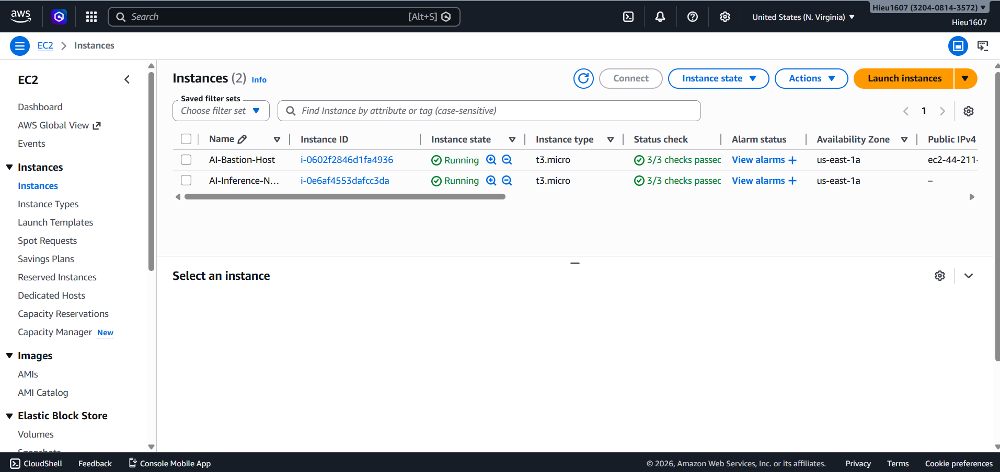
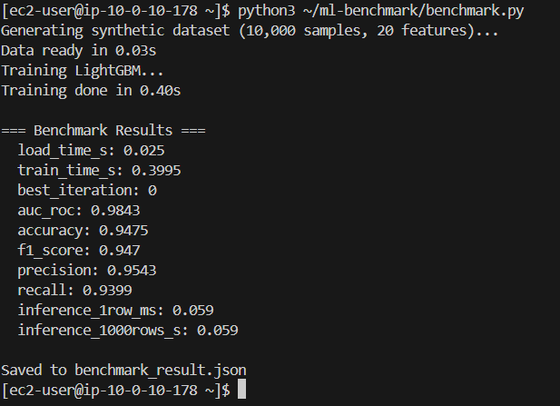
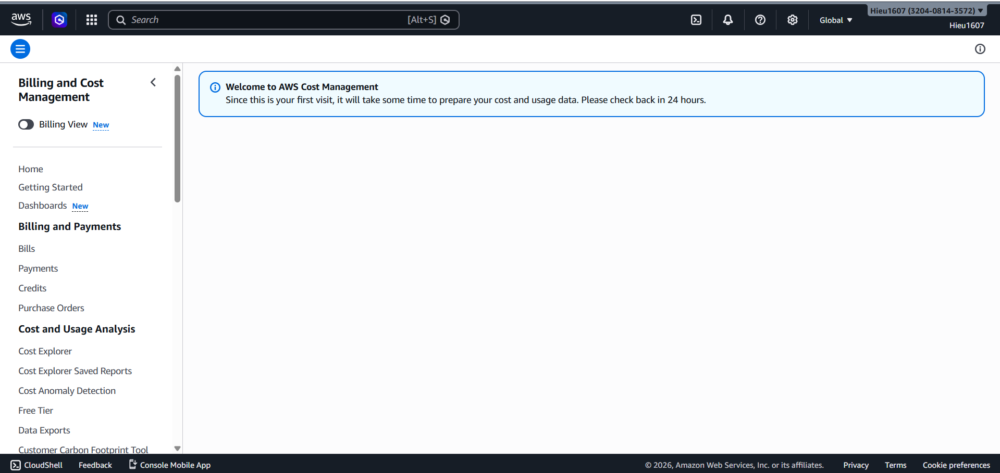

# Lab 16 — Báo cáo Phương án CPU + LightGBM (Track 2)

**Sinh viên:** Hieu1607  
**Ngày thực hiện:** 23/04/2026  
**Region:** us-east-1 (N. Virginia)

---

## 1. Lý do sử dụng phương án CPU thay GPU

Tài khoản AWS được tạo mới trong ngày thực hiện lab (23/04/2026), do đó gặp hai giới hạn sau:

- **Quota GPU = 0 vCPU:** Theo mặc định AWS khóa hạn mức cho dòng G/VT instances (g4dn.xlarge cần 4 vCPU). Yêu cầu tăng quota chưa được duyệt trong thời gian thực hiện bài lab.
- **Cost Management chưa khả dụng:** AWS Cost Management/Billing Dashboard hiển thị thông báo *"Since this is your first visit, it will take some time to prepare your cost and usage data. Please check back in 24 hours."* — tài khoản mới cần ít nhất 24 giờ để hệ thống billing thu thập dữ liệu.

Vì vậy, theo hướng dẫn tại **Phần 7** của README, bài lab chuyển sang triển khai **LightGBM trên `t3.micro` CPU instance** — phương án thay thế hợp lệ với đầy đủ quy trình: Terraform IaC → Cloud instance → Training → Inference.

---

## 2. Kiến trúc triển khai

| Thành phần | Chi tiết |
|---|---|
| IaC Tool | Terraform |
| Region | us-east-1 |
| VPC | Private VPC (10.0.0.0/16) |
| Bastion Host | `t3.micro` — Public Subnet (ec2-44-211-...) |
| ML Node (CPU) | `t3.micro` — Private Subnet (10.0.10.178) |
| NAT Gateway | 1 NAT GW tại Public Subnet |
| Load Balancer | Application Load Balancer (ALB) |
| ML Framework | LightGBM (gradient boosting) |
| Dataset | Synthetic — 10,000 samples, 20 features (sklearn) |

Screenshot AWS EC2 Instances Console:



---

## 3. Kết quả Benchmark trên `t3.micro`

Benchmark được chạy bằng lệnh:

```bash
python3 ~/ml-benchmark/benchmark.py
```

Screenshot terminal:



### Kết quả chi tiết

| Metric | Kết quả |
|---|---|
| Thời gian load data | 0.025 s |
| Thời gian training | 0.40 s |
| Best iteration | 0 |
| AUC-ROC | **0.9843** |
| Accuracy | **0.9475** |
| F1-Score | **0.947** |
| Precision | 0.9543 |
| Recall | 0.9399 |
| Inference latency (1 row) | 0.059 ms |
| Inference throughput (1000 rows) | 0.059 s |

File kết quả: [`benchmark_result.json`](benchmark_result.json)

---

## 4. Ước tính chi phí (1 giờ, us-east-1)

| Dịch vụ | Instance/Loại | Chi phí/giờ |
|---|---|---|
| EC2 — CPU Node | `t3.micro` | ~$0.000 (Free Tier) |
| EC2 — Bastion | `t3.micro` | ~$0.000 (Free Tier) |
| NAT Gateway | 1 AZ | ~$0.045 + data transfer |
| ALB | Application Load Balancer | ~$0.008 |
| **Tổng ước tính** | | **~$0.053/giờ** |

Screenshot AWS Billing Console (tài khoản mới, dữ liệu chưa sẵn sàng):



> Tài khoản được tạo ngày 23/04/2026. AWS Billing cần 24 giờ để populate dữ liệu lần đầu. Chi phí thực tế ước tính dựa trên bảng giá công khai của AWS tại us-east-1.

---

## 5. So sánh và nhận xét

### GPU (g4dn.xlarge + vLLM) vs CPU (t3.micro + LightGBM)

| Tiêu chí | GPU — g4dn.xlarge | CPU — t3.micro (bài này) |
|---|---|---|
| Chi phí/giờ EC2 | ~$0.526 | ~$0.000 (Free Tier) |
| Yêu cầu quota | 4 vCPU G-instance | Không cần |
| Cold start time | 15–25 phút (kéo model ~vài GB) | ~10–15 phút (Terraform) |
| Loại tác vụ | LLM inference (Gemma 4-E2B) | ML training + inference (LightGBM) |
| AUC-ROC | N/A (generative) | **0.9843** |
| Inference latency | ~100–500 ms/token | **0.059 ms/row** |
| Phù hợp với | Production LLM API | Tabular ML, cost-sensitive workload |

### Nhận xét

- LightGBM trên `t3.micro` đạt **AUC-ROC = 0.9843** và **Accuracy = 0.9475** trên synthetic dataset 10,000 mẫu — kết quả tốt với thời gian training chỉ **0.40 giây**.
- Inference latency cực thấp (**0.059 ms/row**) cho thấy LightGBM phù hợp với các tác vụ real-time scoring không yêu cầu GPU.
- Phương án CPU hoàn toàn thực hiện được quy trình IaC đầy đủ (Terraform → EC2 → Training → Inference), chỉ khác là không triển khai LLM.
- Chi phí gần như bằng 0 nhờ Free Tier, phù hợp cho môi trường học tập và thử nghiệm.

---

## 6. Dọn dẹp tài nguyên

Sau khi hoàn thành benchmark và chụp ảnh, toàn bộ tài nguyên AWS được xóa bằng:

```bash
cd terraform
terraform destroy
```

Lệnh này xóa toàn bộ: VPC, Subnets, NAT Gateway, ALB, EC2 instances, Security Groups, và IAM resources — đảm bảo không phát sinh thêm chi phí.
